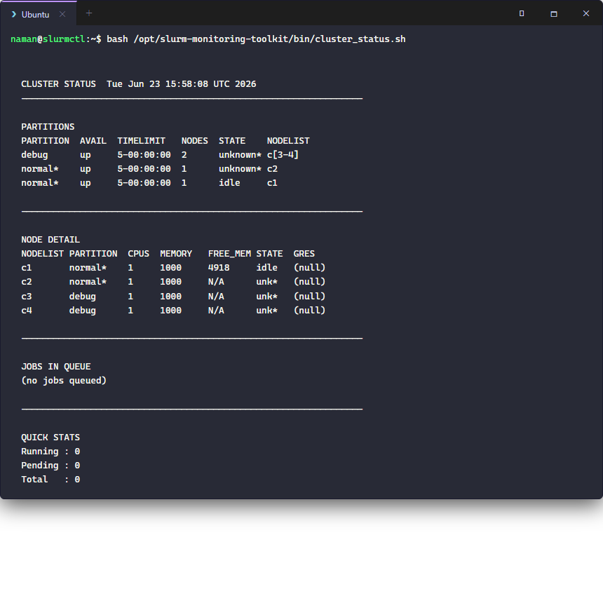
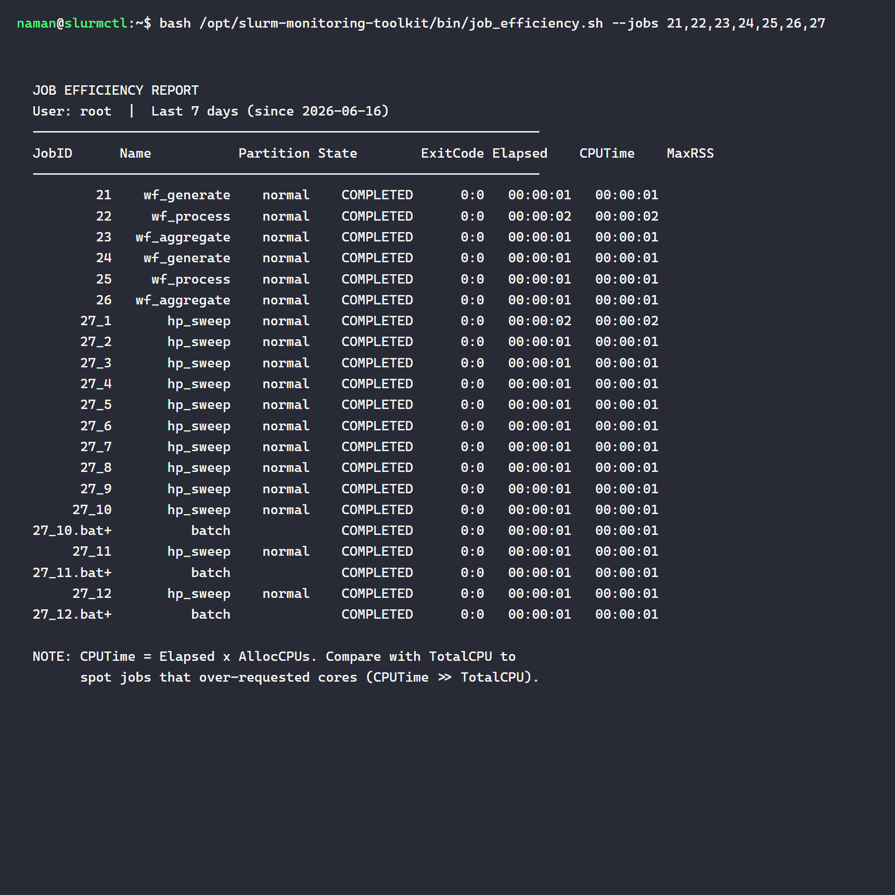
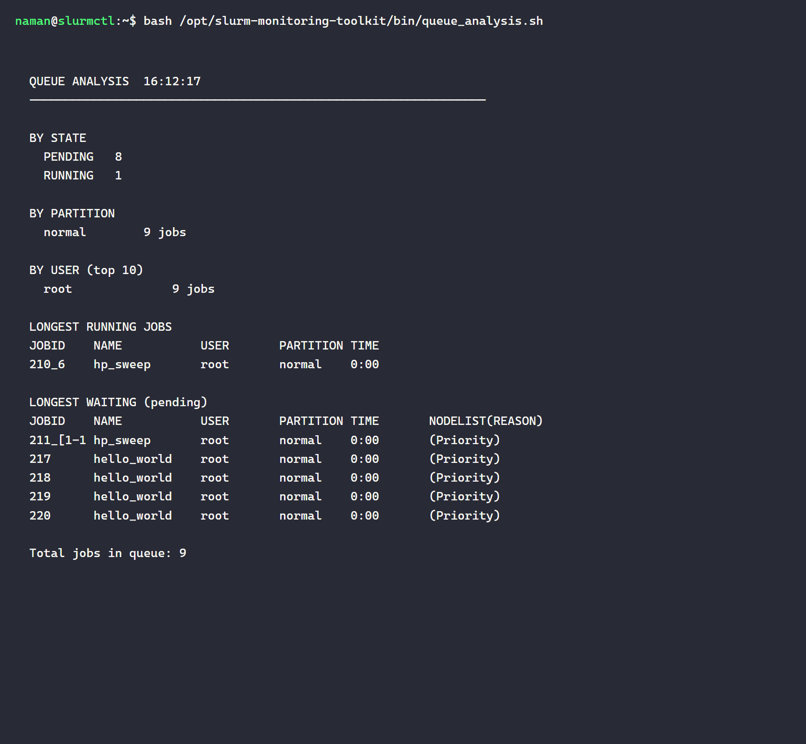
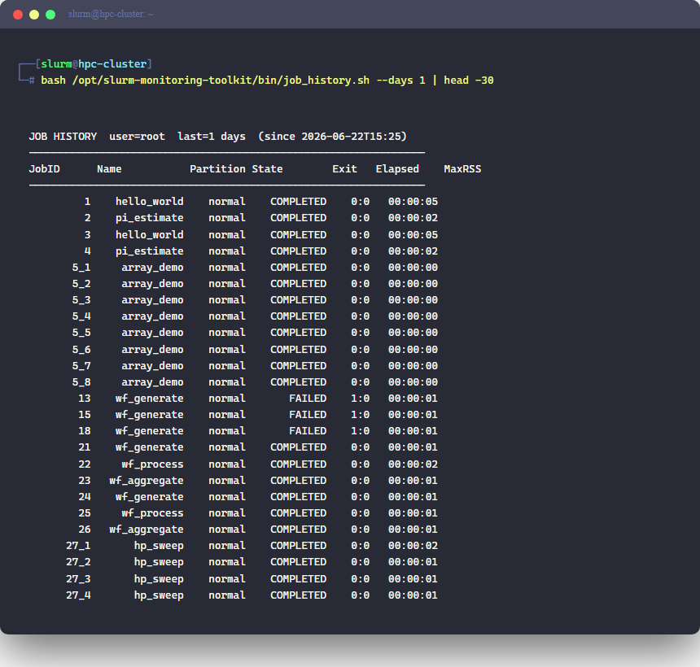

# slurm-monitoring-toolkit

A set of four shell scripts that wrap `sinfo`, `squeue`, and `sacct` into more readable, opinionated views of cluster and job state. Useful as everyday tools on any Slurm cluster - copy them into `~/bin/` and `chmod +x`.

## Scripts

| Script | What it does |
|---|---|
| `bin/cluster_status.sh` | One-page cluster overview: partitions, per-node detail, current queue, totals |
| `bin/job_efficiency.sh` | CPU and memory accounting for a set of jobs (`--jobs`) or a user's recent history |
| `bin/queue_analysis.sh` | Queue breakdown by state / partition / user; longest running and longest waiting |
| `bin/job_history.sh` | Chronological list of a user's jobs with state, exit code, and elapsed time |

## cluster_status.sh

```bash
bash bin/cluster_status.sh
```

Shows partition availability, per-node CPU/memory/state, current jobs, and a running/pending count.



## job_efficiency.sh

```bash
bash bin/job_efficiency.sh --jobs 21,22,23,24,25,26,27
# or: --user myuser  --days 7
```

Reports elapsed time, CPU time, and MaxRSS for each job. The key insight: if `CPUTime >> TotalCPU` the job over-requested cores; if `MaxRSS << ReqMem` it over-requested memory.



## queue_analysis.sh

```bash
bash bin/queue_analysis.sh
```

Breaks the live queue down by state, partition, and user. Also shows which jobs have been running or waiting longest - useful for spotting stuck jobs or a particular user monopolizing resources.



## job_history.sh

```bash
bash bin/job_history.sh --days 1
bash bin/job_history.sh --user alice --days 30
```

Lists all jobs for a user in the given window with their final state, exit code, and elapsed time. Failed jobs stand out next to their surrounding completed neighbours - useful for auditing a pipeline run.



The history above captures the full story of today's session: serial jobs (1–4), 8-task array (5_1–5_8), failed pipeline attempts (13, 15, 18) before the working-directory fix, successful pipeline runs (21–26), and the 12-task hyperparameter sweep (27_1–27_12).

## Usage patterns

**Quick morning check before submitting:**
```bash
bash bin/cluster_status.sh
```

**Find out why your job is still pending:**
```bash
bash bin/queue_analysis.sh | grep -A5 "LONGEST WAITING"
```

**Check yesterday's efficiency after a big run:**
```bash
bash bin/job_efficiency.sh --user $USER --days 1
```

**Audit a pipeline that partially failed:**
```bash
bash bin/job_history.sh --days 1 | grep -E 'FAILED|CANCELLED'
```

## Key commands behind the scripts

| Command | Purpose |
|---|---|
| `sinfo` | Node and partition state |
| `squeue` | Jobs currently in the queue |
| `sacct` | Historical accounting for completed jobs |
| `scontrol show job <ID>` | Full detail on one job |
| `scancel <ID>` | Cancel a running or pending job |
| `sstat -j <ID>` | Live resource usage of a running job |
